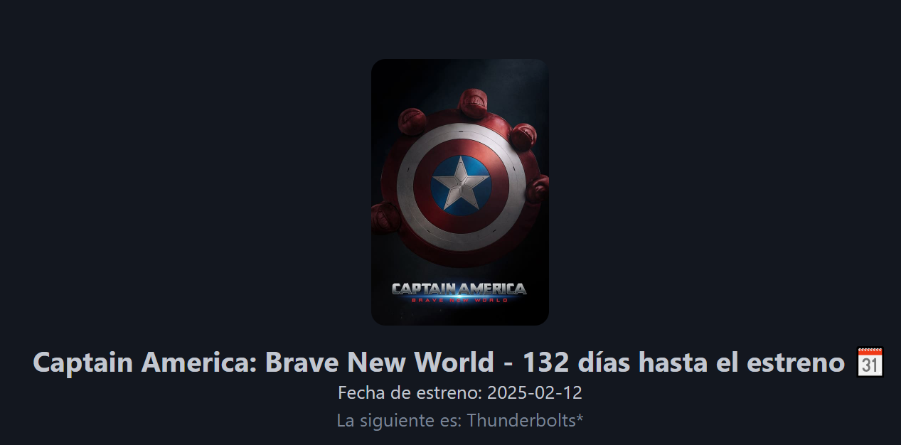

# Proyecto de Próxima Película 🎬

Este proyecto muestra información sobre la próxima película usando datos dinámicos obtenidos desde una API. Está desarrollado en PHP.

## Instrucciones para ejecutar el proyecto 🚀

### 1. Clonar el repositorio
Primero, clona este repositorio en tu máquina local utilizando Git.

### 2. Ejecutar el servidor PHP
Para ejecutar el proyecto en un servidor PHP local, simplemente ejecuta el siguiente comando en tu terminal:

Copiar código: php -S localhost:8000

Este comando iniciará un servidor en la dirección http://localhost:8000, donde podrás visualizar el proyecto en tu navegador.

### 3.Visualización de la aplicación
Así se verá la aplicación cuando se ejecute correctamente en tu navegador:

